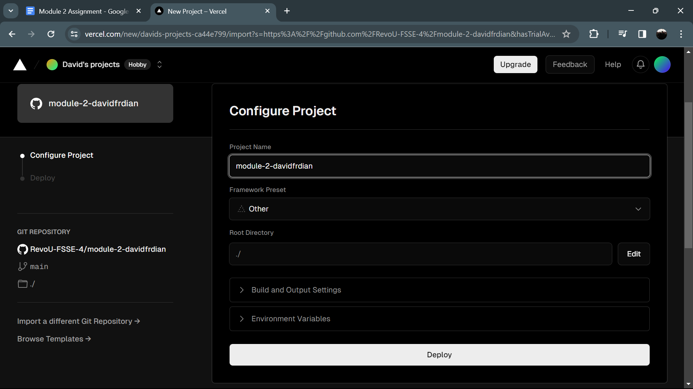

# Spider Club

[Here](https://spiderclub.vercel.app/) is our website before custom domain,
and [click here](https://spiderclub.site/) to see our website after use custom domain!🕸️🕷️

## Table of Contents
- [Introduction](#introduction)
- [Deployment](#deployment)
- [Author](#author)

## Introduction
Spider Club website serves as a portal into the heart of our community. Here, enthusiasts of all ages and backgrounds unite under the common love for the iconic web-slinger. 

Our platform is more than just a gathering of fans; it's a celebration of Spider-Man's enduring legacy and the impact he has had on countless lives.

## Deployment
### Vercel Sign up & Connect with Github
1. First, open [Vercel](https://vercel.com) and login with Github
	

2. Now, you already login to Vercel
	

### Deployment on Vercel
1. Click Add New on home page, and choose project

2. This is page for import your repository from Github

3. Select the repository that you want on here

4. After that, you can find your project with search bar and click import

5. Set yout project name and Deploy it

6. Congratulations! your project is already deploy with Vercel😄

### Setting Custom Domain with Vercel, Niagahoster, and Cloudflare
1. Click domains button on your project page

2. Write your domain custom name that you already buy on Niagahoster

3. Choose one from the options. In that case, I chose the one recommended by Vercel

4. The domain will invalid configuration because we haven't set that in Cloudflare and Niagahoster

5. Next step, open Cloudflare and login

6. After stand on the home page, click 'Add site'

7. Write your domain custom name and click continue

8. If you haven't buy the domain, you can visiting [Niagahoster](https://niagahoster.com) first

9. Login in here anything you want, and don't forget to buy your domain on domain menu, follow the process until payment

10. Back to cloudflare and copy the nameservers

11. Put the nameservers to the Niagahoster and save it.

12. Open [Nslookup.io](https://www.nslookup.io/) and put your vercel domain on search bar to find IP for Cloudflare

13. Put the IPv4 Adress with Add record feature and save

14. Back to Vercel to see the results, your domain custom name on Vercel will valid 

15. Finally, your domain custom name has been applied 🎊🎉

## Author
- LinkedIn : [David Ferdian](https://www.linkedin.com/in/davidferdian)
- Instagram : [David Ferdian](https://www.instagram.com/david_f.h/)

